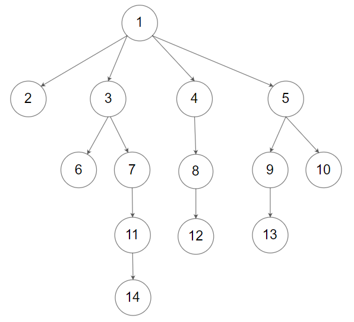

## 题目

[590. N 叉树的后序遍历]([题目链接](https://leetcode-cn.com/problems/n-ary-tree-postorder-traversal/))

难度: 简单

<!--more-->

给定一个 N 叉树，返回其节点值的 **后序遍历** 。

N 叉树 在输入中按层序遍历进行序列化表示，每组子节点由空值 `null` 分隔（请参见示例）。

**进阶：**

递归法很简单，你可以使用迭代法完成此题吗?

**示例 1：**

'''html
       1
    /  |  \
  3    2   4
 / \
5   6
'''

> **输入：**root = [1,null,3,2,4,null,5,6]
> **输出：**[5,6,3,2,4,1]

**示例 2：**



> **输入：**root = [1,null,2,3,4,5,null,null,6,7,null,8,null,9,10,null,null,11,null,12,null,13,null,null,14]
> **输出：**[2,6,14,11,7,3,12,8,4,13,9,10,5,1]

**提示：**

- N 叉树的高度小于或等于 1000
- 节点总数在范围 $[0, 10^4]$ 内

---

## 递归

递归方法很简单，只需先**递归的**遍历孩子结点再遍历根结点即可

```python
# Code language: Python
class Solution:
    def postorder(self, root: 'Node') -> List[int]:
        def dfs(root: 'Node') -> None:
            for child in root.children:
                dfs(child)
            value.append(root.val)
        
        value = []
        if root:
            dfs(root)
        return value
```

```java
/* Code language: Java */
class Solution {
    public List<Integer> postorder(Node root) {
        List<Integer> value = new ArrayList<>();
        post(root, value);
        return value;
    }

    private void post(Node root, List<Integer> value) {
        if (root != null) {
            for (Node cur : root.children) {
                if (cur != null)
                    post(cur, value);
            }
            value.add(root.val);
        }
    }
}
```

```cpp
/* Code language: C++ */
class Solution {
public:
    vector<int> value;
    void dfs(Node* root){
        for (auto child: root->children)
            dfs(child);
        value.emplace_back(root->val);
    }

    vector<int> postorder(Node* root) {
        if (root != nullptr)
            dfs(root);
        return value;
    }
};
```

- 时间复杂度: $O(n)$ ，每个结点仅访问一次
- 空间复杂度: $O(n)$ ，N叉树成链表形式的时候递归深度会达到 $n$

---

## 迭代

与二叉树类似，后序遍历的迭代方法有种 **取巧** 的办法，即使用先序遍历，但遍历时正序遍历孩子结点，再将结果翻转，或者结果放在双端队列中，每次都在队头插入，即可得到 “后序遍历”。

上述的方法实际上并没有按照 **“后序”** 的顺序访问结点，换而言之，这种“后序遍历”实际上是一种变形的先序遍历.

下面将提供一种按照 **“后序”** 的访问顺序的后序遍历，但N叉树的后序遍历与二次树的大同小异，所以请确保您已经理解并能够写出二叉树的 后序遍历 的非递归写法再继续阅读；如果不能，请先完成这题： [145. 二叉树的后序遍历](https://leetcode-cn.com/problems/binary-tree-postorder-traversal/)

好的，现在假设您已经学会了二叉树的非递归后序遍历，我们来看一看N叉树的后序遍历有什么不同。

二叉树与N叉树的唯一区别仅仅在于 **孩子结点的数量**，在二叉树的后序非递归算法中，我们使用了一个变量 `prev` 来记录上一个遍历的结点，这个变量的作用是用于区分栈顶结点的右子树是否已经遍历过，回忆二叉树的前序和中序遍历，栈中存放的结点是 **未访问的** 和 **访问过左子树的** 结点，而后序遍历栈中同时存放了 **访问过左子树和访问过右子树的** 结点，所以需要一个标志即 `prev` 来区分这两种结点。

现在，从二叉树拓展到N叉树，孩子结点的数量不再是只有两个了，栈中可能会同时存在 **访问过一个孩子结点的、访问过两个孩子结点的、访问过三个孩子结点的……** 的结点，~~这个时候仅仅一个标志已经无法帮助我们区分这些不同访问层次的结点~~(后面仔细想下一个标志也可以实现，但是需要遍历孩子数组检索遍历到哪个孩子结点了，一方面会增加编程难度，另一方面如果N很大还会增大时间复杂度)，所以相对应的对于每一个结点，我们都要设置一个标志来记录该结点有多少个孩子结点已经遍历过了。

由此，我们很容易就能由二叉树的后序非递归得到N叉树的后序非递归算法：

- 对于访问二叉树的左孩子结点，我们改为访问N叉树的第一个孩子结点
- 对于访问二叉树的右孩子结点，我们取得标志(已访问过的孩子数)然后访问下一个孩子结点
- 对于判断是否访问过右孩子结点，我们根据标志判断孩子结点是否全部访问过

```python
# Code language: Python
class Solution:
    def postorder(self, root: 'Node') -> List[int]:
        value, s = [], []
        cur = root
        while s or cur:
            while cur:
                s.append((cur, 0))
                if cur.children:
                    cur = cur.children[0]
                else:
                    cur = None
            cur, c = s.pop()
            if not cur.children or c >= len(cur.children):
                value.append(cur.val)
                cur = None
            else:
                c += 1
                s.append((cur, c))
                if c < len(cur.children):
                    cur = cur.children[c]
                else:
                    cur = None
        return value
```

```java
/* Code language: Java */
class Solution {
    public List<Integer> postorder(Node root) {
        List<Integer> value = new ArrayList<>();
        // child 记录 对应结点 已经遍历过的孩子数量
        Deque<Node> s = new ArrayDeque<>();
        Deque<Integer> child = new ArrayDeque<>();
        Node cur = root;
        int next;
        while (!s.isEmpty() || cur != null) {
            while (cur != null) {
                s.addLast(cur);
                child.add(0);
                if (cur.children.size() > 0) {
                    cur = cur.children.get(0);
                } else
                    cur = null;
            }
            cur = s.pollLast();
            next = child.pollLast();
            if (cur.children.size() == 0 || next >= cur.children.size()) {
                value.add(cur.val);
                cur = null;
            } else {
                s.addLast(cur);
                child.addLast(next + 1);
                if (next + 1 < cur.children.size())
                    cur = cur.children.get(next + 1);
                else
                    cur = null;
            }
        }
        return value;
    }
}
```

```cpp
/* Code language: C++ */
class Solution {
public:
    vector<int> postorder(Node* root) {
        vector<int> value;
        stack<pair<Node*, int>> s;
        auto cur = pair(root, 0);
        while (!s.empty() || cur.first != nullptr) {
            while (cur.first != nullptr) {
                s.push(cur);
                if (cur.first->children.size() > 0)
                    cur = pair(cur.first->children[0], 0);
                else
                    cur.first = nullptr;
            }
            cur = s.top();
            s.pop();
            if (cur.first->children.size() == 0 || cur.second >= cur.first->children.size()) {
                value.emplace_back(cur.first->val);
                cur.first = nullptr;
            }
            else {
                ++cur.second;
                s.push(cur);
                if (cur.second < cur.first->children.size())
                    cur = pair(cur.first->children[cur.second], 0);
                else
                    cur.first = nullptr;
            }
        }
        return value;
    }
};
```

- 时间复杂度: $O(n \times N)$ ，每个结点都会入栈出栈 孩子数量 次，满N叉树下复杂度达到 $O(n \times N)$ ，其中 $n$ 为树中结点的数量
- 空间复杂度: $O(n)$，N叉树为链表状时空间复杂度最大
