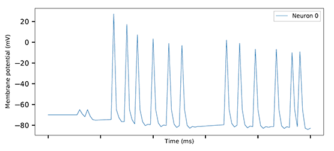

# 2021.09.23

## 脉冲神经网络

- 时间限制：  1.0s
- 内存限制：  512.0MB 

### 题目背景

在本题中，你需要实现一个 SNN（spiking neural network，脉冲神经网络）的模拟器。一个 SNN 由以下几部分组成：

1. 神经元：按照一定的公式更新内部状态，接受脉冲并可以发放脉冲
2. 脉冲源：在特定的时间发放脉冲
3. 突触：连接神经元-神经元或者脉冲源-神经元，负责传递脉冲

### 题目描述

神经元会按照一定的规则更新自己的内部状态。本题中，我们对时间进行离散化处理，即设置一个时间间隔$\Delta{t}$，仅考虑时间间隔整数倍的时刻$t=k\Delta{t}(k \in Z^+)$，按照下面的公式，从 $k-1$ 时刻的取值计算 $k$ 时刻的变量的取值：
$$
v_k=v_{k-1} + \Delta{t}(0.04v_{k-1}^2 + 5v_{k-1} + 140 - u_{k-1}) + I_k  \\
u_k=u_{k-1} + \Delta{t}a(bv_{k-1} - u_{k-1})
$$
其中 $v$ 和 $u$ 是神经元内部的变量，会随着时间而变化，$a$ 和 $b$ 是常量，不会随着时间变化；其中 $I_k$ 表示该神经元在 $k$ 时刻接受到的所有脉冲输入的强度之和，如果没有接受到脉冲，那么 $I_k=0$。当进行上面的计算后，如果满足 $v_k \ge 30，$神经元会发放一个脉冲，脉冲经过突触传播到其他神经元；同时，$v_k$ 设为 $c$ 并且 $u_k$ 设为 $u_k+d$，其中 $c$ 和 $d$ 也是常量。图 1 展示了一个神经元 $v$ 变量随时间变化的曲线。



图1: 神经元 $v$ 变量随时间变化的曲线

突触表示的是神经元-神经元、脉冲源-神经元的连接关系，包含一个入结点和一个出结点（可能出现自环和重边）。当突触的入结点（神经元或者脉冲源）在 $k$ 时刻发放一个脉冲，那么在传播延迟 $D(D>0)$ 个时刻以后，也就是在 $k+D$ 时刻突触的出结点（神经元）会接受到一个强度为 $w$  的脉冲。

脉冲源在每个时刻以一定的概率发放一个脉冲，为了模拟这个过程，每个脉冲源有一个参数 $0 < r \le 32,767$，并统一采用以下的伪随机函数：

C++ 版本：

```c++
static unsigned long next = 1;

/* RAND_MAX assumed to be 32767 */
int myrand(void) {
    next = next * 1103515245 + 12345;
    return((unsigned)(next/65536) % 32768);
}
```

Python 版本：

```Python
next = 1
def myrand():
    global next
    next = (next * 1103515245 + 12345) % (2 ** 64)
    return (next // 65536) % 32768
```

Java 版本：

```java
long next = 1;
int myrand() {
    next = next * 1103515245 + 12345;
    return (int)((Long.divideUnsigned(next, 65536)) % 32768);
}
```

在每个时间刻，按照编号顺序从小到大，每个脉冲源调用一次上述的伪随机函数，当 $r > \text{myrand()}$ 时，在当前时间刻发放一次脉冲，并通过突触传播到神经元。

进行仿真的时候，已知 0 时间刻各个神经元的状态，从 1 时间刻开始按照上述规则进行计算，直到完成 $T$ 时刻的计算，再输出 $T$ 时刻神经元的 $v$ 值和发放的脉冲次数分别的最小值和最大值。

规定输入数据中结点按如下方式顺序编号：$[0,N−1]$ 为神经元的编号，$[N, N+P-1]$ 为脉冲源的编号。

代码中请使用双精度浮点类型。

### 输入格式

从标准输入读入数据。

输入的第一行包括四个以空格分隔的正整数 $N$ $S$ $P$ $T$，表示一共有 $N$ 个神经元，$S$ 个突触和 $P$ 个脉冲源，输出时间刻 $T$ 时神经元的 $v$ 值。

输入的第二行是一个正实数 $\Delta{t}$，表示时间间隔。

输入接下来的若干行，每行有以空格分隔的一个正整数 $R_N$ 和六个实数 $v$ $u$ $a$ $b$ $c$ $d$，按顺序每一行对应 $R_N$ 个具有相同初始状态和常量的神经元：其中 $v$ $u$ 表示神经元在时刻 0 时的变量取值；$a$ $b$ $c$ $d$ 为该神经元微分方程里的四个常量。保证所有的 $R_N$ 加起来等于 $N$。它们从前向后按编号顺序描述神经元，每行对应一段连续编号的神经元的信息。

输入接下来的 $P$ 行，每行是一个正整数 $r$，按顺序每一行对应一个脉冲源的 $r$ 参数。

输入接下来的 $S$ 行，每行有以空格分隔的两个整数 $s(0 \le s < N+P)$、$t(0 \le t < N)$ 、一个实数 $w(w \ge 0)$ 和一个正整数 $D$，其中 $s$ 和 $t$ 分别是入结点和出结点的编号；$w$ 和 $D$ 分别表示脉冲强度和传播延迟。

### 输出格式

输出到标准输出。

输出共有两行，第一行由两个近似保留 3 位小数的实数组成，分别是所有神经元在时刻 $T$ 时变量 $v$ 的取值的最小值和最大值。第二行由两个整数组成，分别是所有神经元在整个模拟过程中发放脉冲次数的最小值和最大值。

只要按照题目要求正确实现就能通过，不会因为计算精度的问题而得到错误答案。

### 样例1输入

```Data
1 1 1 10
0.1
1 -70.0 -14.0 0.02 0.2 -65.0 2.0
30000
1 0 30.0 2
```

### 样例1输出

```Data
-35.608 -35.608
2 2
```

### 样例1解释

该样例有 1 个神经元、1 个突触和 1 个脉冲源，时间间隔 $\Delta{t}=0.1$。唯一的脉冲源通过脉冲强度为 30.0、传播延迟为 2 的突触传播到唯一的神经元。

该样例一共进行 10 个时间步的模拟，随机数生成器生成 10 次随机数如下：

```None
16838
5758
10113
17515
31051
5627
23010
7419
16212
4086
```

因此唯一的脉冲源在时刻 1-4 和 6-10 发放脉冲。在时间刻从 1 到 10 时，唯一的神经元的 $v$ 取值分别为：

```None
-70.000
-70.000
-40.000
-8.200
-65.000
-35.404
-32.895
0.181
-65.000
-35.608
```

该神经元在时刻 5 和时刻 9 发放，最终得到的 $v=-35.608$ 。

### 样例2输入

```Data
2 4 2 10
0.1
1 -70.0 -14.0 0.02 0.2 -65.0 2.0
1 -69.0 -13.0 0.04 0.1 -60.0 1.0
30000
20000
2 0 15.0 1
3 1 20.0 1
1 0 10.0 2
0 1 40.0 3
```

### 样例2输出

```Data
-60.000 -22.092
1 2
```

### 子任务

| 子任务 |    $T$     | $N$  | $S$  | $P$  | $D$  | 分值 |
| :----: | :--------: | :--: | :--: | :--: | :--: | :--: |
|   1    | $\le 10^2$ | $\le 10^2$ | $\le 10^2$ | $\le 10^2$ | $\le 10^2$ |  30  |
|   2    |    $\le 10^3$    | $\le 10^3$ | $\le 10^3$ | $\le 10^3$ | $\le 10^3$ |  40  |
|   3    |    $\le 10^5$    | $\le 10^3$ | $\le 10^3$ | $\le 10^3$ | $\le 10$  |  30  |

### 33 分代码

错误原因：超时。。。（模拟题居然会超时是万万没想到的，还是python的原因？）

```python
# --------------------测试用，提交前请注释掉----------------------

# import sys

# sys.stdin = open('in3.dat', 'r')
# sys.stdout = open('out3.dat', 'w')

# -------------------------------------------------------------
from collections import deque

class Random():
    def __init__(self) -> None:
        self.next = 1

    def myrand(self):
        self.next = (self.next * 1103515245 + 12345) % (2 ** 64)
        return (self.next // 65536) % 32768

class neural():
    def __init__(self, v, u, a, b, c, d, dt) -> None:
        self.v, self.u, self.a, self.b, self.c, self.d, self.dt = v, u, a, b, c, d, dt
        self.Ik = 0
        self.out_connect = list()
        self.cnt = 0
    
    def update(self):
        self.v, self.u = self.v + self.dt * (0.04 * self.v ** 2 + 5 * self.v + 140 - self.u) + self.Ik, self.u + self.dt * self.a * (self.b * self.v - self.u)
        if self.v >= 30:
            self.launch()
            self.v, self.u = self.c, self.u + self.d
        self.Ik = 0
    
    def receve(self, w):
        self.Ik += w

    def launch(self):
        for c in self.out_connect:
            c.receve()
        self.cnt += 1

class source():
    def __init__(self, r):
        self.r = r
        self.out_connect = list()
    
    def update(self, rand):
        if self.r > rand:
            self.launch()
    
    def launch(self):
        for c in self.out_connect:
            c.receve()

class connect():
    def __init__(self, s, t, w, D) -> None:
        self.s, self.t, self.w, self.Delay = s, t, w, D
        self.signal = deque([0 for _ in range(D)], maxlen=D)
        self.cur = 0
    
    def receve(self):
        self.cur += 1

    def launch(self, s):
        self.t.receve(self.w * s)
    
    def update(self):
        c = self.signal.popleft()
        if c > 0:
            self.launch(c)

    def clear(self):
        self.signal.append(self.cur)
        self.cur = 0

def main():
    rand = Random()
    N, S, P, T = map(int, input().split())
    dt = float(input())
    cnt = N
    network = list()
    conn = list()
    while cnt:
        # neural
        RN, v, u, a, b, c, d = map(float, input().split())
        RN = int(RN)
        cnt -= RN
        for _ in range(RN):
            network.append(neural(v, u, a, b, c, d, dt))
    for _ in range(P):
        # source
        r = int(input())
        network.append(source(r))
    for _ in range(S):
        # connect
        s, t, w, D = input().split()
        s, t, D = map(int, (s, t, D,))
        w = float(w)
        c = connect(s, network[t], w, D)
        conn.append(c)
        network[s].out_connect.append(c)
    for _ in range(T):
        for i in range(N, N + P):
            network[i].update(rand.myrand())
        for c in conn:
            c.update()
        for i in range(N):
            network[i].update()
        for c in conn:
            c.clear()
    print("{:.3f} {:.3f}".format(round(min(network[i].v for i in range(N)), 3), round(max(network[i].v for i in range(N)), 3)))
    print("{} {}".format(min(network[i].cnt for i in range(N)), max(network[i].cnt for i in range(N))))

# --------------------测试用，提交前请注释掉----------------------
        
main()
# main()

# ---------------------------------------------------------------
```

## 
